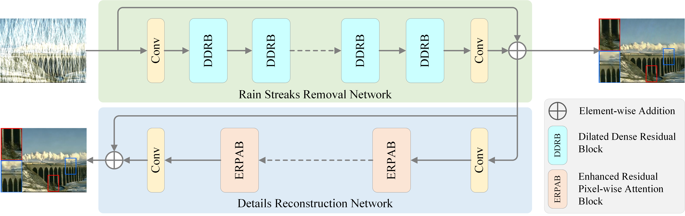

# A Novel Dual-stage Progressive Enhancement Network for Single Image Deraining

[](https://arxiv.org/pdf/2205.03553.pdf)  [](https://github.com/chdwyb/DPENet)

Abstract: The dense rain accumulation in heavy rain can significantly wash out images and thus destroy the background details of images. Although existing deep rain removal models lead to improved performance for heavy rain removal, we find that most of them ignore the detail reconstruction accuracy of rain-free images. In this paper, we propose a dual-stage progressive enhancement network (DPENet) to achieve effective deraining with structure-accurate rain-free images. Two main modules are included in our framework, namely a rain streaks removal network (R2Net) and a detail reconstruction network (DRNet). The former aims to achieve accurate rain removal, and the latter is designed to recover the details of rain-free images. We introduce two main strategies within our networks to achieve trade-off between the effectiveness of deraining and the detail restoration of rain-free images. Firstly, a dilated dense residual block (DDRB) within the rain streaks removal network is presented to aggregate high/low level features of heavy rain. Secondly, an enhanced residual pixel-wise attention block (ERPAB) within the detail reconstruction network is designed for context information aggregation. We also propose a comprehensive loss function to highlight the marginal and regional accuracy of rain-free images. Extensive experiments on benchmark public datasets show both efficiency and effectiveness of the proposed method in achieving structure-preserving rain-free images for heavy rain removal.



## Dependencies
```python
PyTorch 1.7.1
Python 3.6.5
CUDA 10.1
```

## Train and test
DPENet is trained on Rain1400, Rain100H, Rain100L and Rain800，prepare them for training and testing. You can also use your datasets, meanwhile change the path to yours.

After that, you can train and test the DPENet by

```python
python main.py
```

## Quick test
pre-trained models can be found at ./logs, meanwhile change the path to yours. you can test the DPENet by

```python
python test.py
```

## Citation
If you find this project useful in your research, please consider citing:

```
@article{gao2022heavy,
      title={From Heavy Rain Removal to Detail Restoration: A Faster and Better Network}, 
      author={Tao Gao and Yuanbo Wen and Jing Zhang and Kaihao Zhang and Ting Chen},
      journal={arXiv preprint arXiv:2205.03553},
      year={2022},
}
```

## Contact us
Please contact us if there is any question or suggestion (wyb@chd.edu.cn).
